# gh-magic-matrix

A collection of GitHub Actions for creating various animations and visualizations from contribution matrices.

## 🚀 Quick Start

```yaml
# Breathing animation - aggregates all history, cells breathe
- uses: diverger/gh-magic-matrix@main
  with:
    github_user_name: ${{ github.repository_owner }}
    output_path: dist/breathing-contrib/dark.svg

# Blinking animation - shows years sequentially with fade transitions
- uses: diverger/gh-magic-matrix/blinking-contrib@main
  with:
    github_user_name: ${{ github.repository_owner }}
    output_path: dist/blinking-contrib/dark.svg

# Snake animation - snake eats contributions using pathfinding
- uses: diverger/gh-magic-matrix/snake@main
  with:
    github_user_name: ${{ github.repository_owner }}
    output_path: dist/snake/dark.svg
```yaml

## Actions

### 💨 Breathing Contribution Grid

Generate a breathing light effect animation from your GitHub contribution grid. Each cell breathes with intensity based on contribution count.

<picture>
  <source
    media="(prefers-color-scheme: dark)"
    srcset="https://raw.githubusercontent.com/diverger/gh-magic-matrix/output/breathing-contrib/dark.svg"
  />
  <source
    media="(prefers-color-scheme: light)"
    srcset="https://raw.githubusercontent.com/diverger/gh-magic-matrix/output/breathing-contrib/light.svg"
  />
  
</picture>

**[📖 Full Documentation](./breathing-contrib/README.md)**

### ✨ Blinking Contribution Timeline

Generate an animated SVG that displays your GitHub contributions **year by year** with smooth fade transitions, creating a **starry sky blinking effect**. Like watching a movie of your GitHub journey through time!

<picture>
  <source
    media="(prefers-color-scheme: dark)"
    srcset="https://raw.githubusercontent.com/diverger/gh-magic-matrix/output/blinking-contrib/dark.svg"
  />
  <source
    media="(prefers-color-scheme: light)"
    srcset="https://raw.githubusercontent.com/diverger/gh-magic-matrix/output/blinking-contrib/light.svg"
  />
  
</picture>

**[📖 Full Documentation](./blinking-contrib/README.md)**

### 🐍 Snake Contribution Grid

Generate an animated SVG showing a snake eating GitHub contributions using advanced pathfinding algorithms inspired by the popular snk project. Features sophisticated A* pathfinding and tunnel-based optimization for smooth, optimal snake movement.

<picture>
  <source
    media="(prefers-color-scheme: dark)"
    srcset="https://raw.githubusercontent.com/diverger/gh-magic-matrix/output/snake/dark.svg"
  />
  <source
    media="(prefers-color-scheme: light)"
    srcset="https://raw.githubusercontent.com/diverger/gh-magic-matrix/output/snake/light.svg"
  />
  
</picture>

**[📖 Full Documentation](./snake/README.md)**

> 🎯 **Live examples** are automatically generated daily and available in the [`output` branch](../../tree/output)

## Quick Reference

This repository contains **three GitHub Actions** that can be used independently:

| Action | Usage | Documentation |
|--------|-------|---------------|
| **Breathing** (default) | `uses: diverger/gh-magic-matrix@main` | [📖 breathing-contrib/README.md](./breathing-contrib/README.md) |
| **Blinking** (subdirectory) | `uses: diverger/gh-magic-matrix/blinking-contrib@main` | [📖 blinking-contrib/README.md](./blinking-contrib/README.md) |
| **Snake** (subdirectory) | `uses: diverger/gh-magic-matrix/snake@main` | [📖 snake/README.md](./snake/README.md) |

### Complete Workflow Example

Create a workflow file (e.g., `.github/workflows/contrib-animations.yml`):

```yaml
name: Generate Contribution Animations

on:
  schedule:
    - cron: "0 0 * * *"  # Daily at midnight
  workflow_dispatch:

jobs:
  generate:
    runs-on: ubuntu-latest
    steps:
      - uses: actions/checkout@v4

      # Generate breathing animation (default action)
      - name: Generate breathing contribution animation
        uses: diverger/gh-magic-matrix@main
        with:
          github_user_name: ${{ github.repository_owner }}
          output_path: dist/breathing-contrib/light.svg

      # Generate blinking animation (subdirectory action)
      - name: Generate blinking contribution timeline
        uses: diverger/gh-magic-matrix/blinking-contrib@main
        with:
          github_user_name: ${{ github.repository_owner }}
          output_path: dist/blinking-contrib/dark.svg

      # Generate snake animation (subdirectory action)
      - name: Generate snake contribution animation
        uses: diverger/gh-magic-matrix/snake@main
        with:
          github_user_name: ${{ github.repository_owner }}
          output_path: dist/snake/dark.svg

      - name: Deploy to GitHub Pages
        uses: crazy-max/ghaction-github-pages@v4
        with:
          target_branch: output
          build_dir: dist
        env:
          GITHUB_TOKEN: ${{ secrets.GITHUB_TOKEN }}
```

### Display in Your README

Add the generated SVGs to your profile README with theme support:

```markdown
<!-- Breathing animation -->
<picture>
  <source media="(prefers-color-scheme: dark)" srcset="https://raw.githubusercontent.com/USERNAME/REPO/output/breathing-contrib/dark.svg" />
  <source media="(prefers-color-scheme: light)" srcset="https://raw.githubusercontent.com/USERNAME/REPO/output/breathing-contrib/light.svg" />
  
</picture>

<!-- Blinking animation -->
<picture>
  <source media="(prefers-color-scheme: dark)" srcset="https://raw.githubusercontent.com/USERNAME/REPO/output/blinking-contrib/dark.svg" />
  <source media="(prefers-color-scheme: light)" srcset="https://raw.githubusercontent.com/USERNAME/REPO/output/blinking-contrib/light.svg" />
  
</picture>

<!-- Snake animation -->
<picture>
  <source media="(prefers-color-scheme: dark)" srcset="https://raw.githubusercontent.com/USERNAME/REPO/output/snake/dark.svg" />
  <source media="(prefers-color-scheme: light)" srcset="https://raw.githubusercontent.com/USERNAME/REPO/output/snake/light.svg" />
  
</picture>
```html

For detailed configuration options and advanced usage, see each action's documentation above.

---

## 🧪 CSS Animation Features Test

Testing optimized CSS animation features for GitHub README compatibility:

### Test 1: Basic CSS Features


### Test 2: Optimized Animation (Shared Keyframes)
<svg viewBox="0 0 200 40" width="600" height="120" xmlns="http://www.w3.org/2000/svg">
  <style>
    :root {
      --ce: #161b22;
      --c1: #0e4429;
      --c2: #006d32;
      --c3: #26a641;
      --c4: #39d353;
    }
    
    @keyframes cellEat {
      0%, 99.9% { fill: var(--ce); }
      100% { fill: var(--gc-color); }
    }
    
    .gc {
      animation: cellEat 1ms linear forwards;
      animation-play-state: paused;
    }
    
    .gc0 { --gc-color: var(--c1); animation-delay: -0ms; animation-play-state: running; }
    .gc1 { --gc-color: var(--c1); animation-delay: -500ms; animation-play-state: running; }
    .gc2 { --gc-color: var(--c2); animation-delay: -1000ms; animation-play-state: running; }
    .gc3 { --gc-color: var(--c2); animation-delay: -1500ms; animation-play-state: running; }
    .gc4 { --gc-color: var(--c3); animation-delay: -2000ms; animation-play-state: running; }
    .gc5 { --gc-color: var(--c3); animation-delay: -2500ms; animation-play-state: running; }
    .gc6 { --gc-color: var(--c4); animation-delay: -3000ms; animation-play-state: running; }
    .gc7 { --gc-color: var(--c4); animation-delay: -3500ms; animation-play-state: running; }
    
    @keyframes barGrow {
      0%, 99.9% { transform: scaleX(0); }
      100% { transform: scaleX(var(--pb-max-scale, 1)); }
    }
    
    .pb {
      transform-origin: 0 0;
      animation: barGrow 1ms linear forwards;
      animation-play-state: paused;
    }
    
    .pb0 { fill: var(--c1); --pb-max-scale: 0.25; animation-delay: -1000ms; animation-play-state: running; }
    .pb1 { fill: var(--c2); --pb-max-scale: 0.5; animation-delay: -2000ms; animation-play-state: running; }
    .pb2 { fill: var(--c3); --pb-max-scale: 0.75; animation-delay: -3000ms; animation-play-state: running; }
    .pb3 { fill: var(--c4); --pb-max-scale: 1; animation-delay: -4000ms; animation-play-state: running; }
  </style>
  
  <g>
    <rect class="gc gc0" x="10" y="5" width="8" height="8" />
    <rect class="gc gc1" x="22" y="5" width="8" height="8" />
    <rect class="gc gc2" x="34" y="5" width="8" height="8" />
    <rect class="gc gc3" x="46" y="5" width="8" height="8" />
    <rect class="gc gc4" x="58" y="5" width="8" height="8" />
    <rect class="gc gc5" x="70" y="5" width="8" height="8" />
    <rect class="gc gc6" x="82" y="5" width="8" height="8" />
    <rect class="gc gc7" x="94" y="5" width="8" height="8" />
  </g>
  
  <text x="10" y="25" font-size="8" fill="#8b949e">Grid Cells (1 shared @keyframes)</text>
  
  <g transform="translate(120, 0)">
    <rect class="pb pb0" x="0" y="5" width="15" height="4" />
    <rect class="pb pb1" x="16" y="5" width="15" height="4" />
    <rect class="pb pb2" x="32" y="5" width="15" height="4" />
    <rect class="pb pb3" x="48" y="5" width="15" height="4" />
    <text x="0" y="25" font-size="8" fill="#8b949e">Progress Bar (1 shared @keyframes)</text>
  </g>
</svg>

**Expected Results:**
- ✅ Grid cells should show different colors (green shades)
- ✅ Progress bars should have different widths
- ❓ If you see this working, `animation-delay` + `animation-play-state` + CSS variables are supported!

---

## License

MIT License - see individual action folders for specific details.
